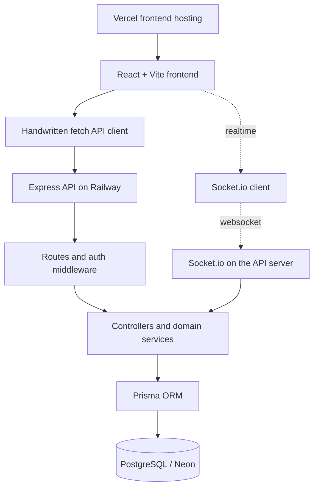

# DevConnect Architecture

## Layers

- `artifacts/devconnect`: React/Vite UI, Wouter routing, React Query server state, Zustand authentication state.
- `lib/shared`: shared response and domain contracts.
- `artifacts/api-server`: Express routes, controllers, validation, authorization, services, and Socket.io integration.
- `lib/db`: Prisma client singleton.
- `prisma`: PostgreSQL schema and migrations.
- Socket.io authenticates the existing HTTP-only JWT cookie during the handshake and joins a per-user room.
- Notifications are persisted in PostgreSQL before being emitted to connected clients.
- Cloudinary is not used by the current implementation.

## Deployment shape

- Frontend: Vercel, configured with `VITE_API_URL` pointing to the Railway API `/api` base.
- Backend: Railway, configured with `DATABASE_URL`, `JWT_SECRET`, `CLIENT_URL`, `SERVER_URL`, and `PORT`.
- Database: Neon PostgreSQL via Prisma.
